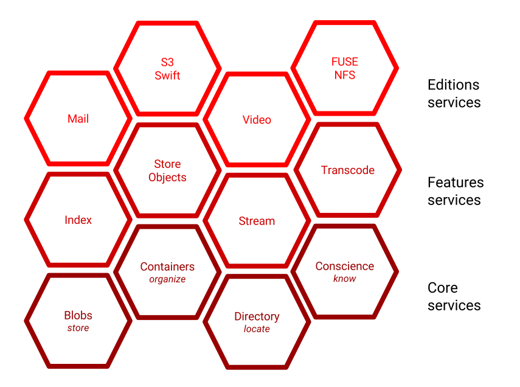
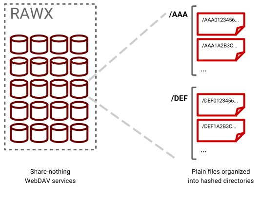
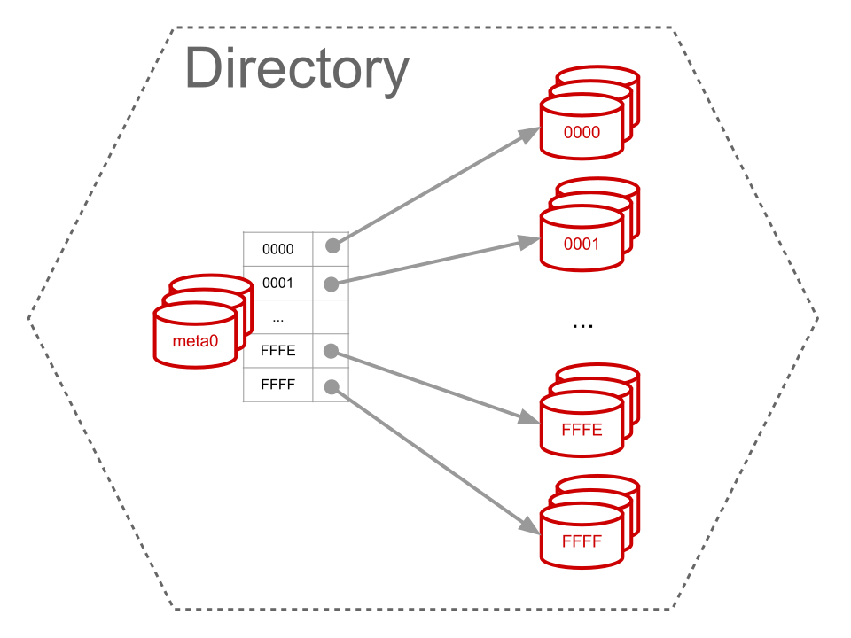

============
Architecture
============

OpenIO designed its object storage as the composition of core services destined
to store email-related files. There is a strong notion of end-user, and more
users than files per user. Let's go step by step to learn why and how each
service finds its own place in the architecture we designed.

The network is the bridge
=========================

You might smile and then you would be on the bright side of the IT crowd, but
there is also a dusty side, with plenty of people with smoked glasses and velvet
suits. Those might consider a humongous SAN could be OK.

No way! We target **low-cost** platforms with so large capacities that we can
not afford such niche technologies.

Chunk the data, and store it
============================

Imagine you have a 200TiB storage capacity, made of 1TiB. You now want to store
a single 20TiB file... You got the point, managing **chunks** of the original is
a necessity! Let's keep in mind we will have to save the information to rebuild
the original content, we will manage this later.

Then we need a simple way to PUT/GET/DELETE chunks, a.k.a. blob, on a storage.
No need of a complicated interface, we chosed to mount large disks as regular
filesystem partitions, and expose them behind simple HTTP services managing the
PUT/GET/DELETE. Then the **rawx** service was born.

The job of the service is to allow a quick access to any chunk.

Chunks -> Contents
==================

The contents are chunked, so it is necessary to keep track of all the
chunks belonging to each content.

Consistently hash the name of the content to get a key, and map this key on a
fixed set of host works great ... as soon as the size of your platform size is
stable.

Our experience proved companies prefer **small increments** of their platform to
an initial one-shot provisioning of the hardware necessary for the next 2 years.
This helps keeping up-to-date on the hardware and smoothens investments.

So OpenIO's choice went to a directory and to avoid consistent hashing.

If the location of the data is not static, let's manage locations in a dynamic
way. We will need a load-balancer to poll available locations for new objects,
and also a directory to remember the polled locations.

Poll chunks locations
=====================

Now we need a functional component able to choose the best set of service for
an upload, i.e. a services that *knows* the state of each service.

We called this service the **conscience**. The services periodically register
in the conscience. They do not mandatorily do this themselves (to keep the
services simple), so the task can be managed by a dedicated process, called
the **conscience-agent**.

What does represent the state of a service from the client's point of view?
Its quality, and we summed it up with a **score**, a positive integer with a value
ranging from 0 to 100. A score of 0 indicates the service must be avoided.
A positive score means the service can be used, the the bigger it is, the best
the quality will be.

The key factors giving the quality of a service may vary, so the score is
computed though an **expression** specific for every service type. That way we
can choose the best factors in each expression, with the right weight. E.g. our
chunk storage service depends more on the I/O capability and the disk capacity
than on RAM or CPU.

At this point, the conscience is still a real SPOF in the solution if it must
be contacted for each content pushed. Because the conscience's content is not
extremely volatile, it is kept in a **cache local to each service** using it.

But that information might be big and the number of services quite high! So the
sum of all the local caches might be huge. This is why we rather keep a cache
in a local and central process, the **proxy**.

.. image:: ../../../images/openio-arch-conscience.svg

Contents -> Container
=====================

Without consistent hashing we need a directory. A few principles and facts led
to the current design.

* We have more mailboxes than emails in the biggest mailbox. In addition, the
  number of emails in a single mailbox is quite small and can be managed by a
  single service.
* We wish for **isolation** at the user-level: we would limit the impact on all
  the users of an operation on a single user.
* We target the ability to efficiently list the objects belonging to a user with
  no help of the application using the object storage. *I.e.* even if the mail
  server has an index of all the emails in each mailbox, we internally keep the
  track of the objects.

For the **insulation** purpose, we choosed to store each container in an
individual SQLite file. Thoses DB files are store in regular volumes and exposed
to the network with the helps of a dedicated service called **meta2**.

  TODO
    Present here the SQLite scheme for containers.

Have many containers
====================

A single service to manage all the containers is not enough, we need to spread
them on several hosts. Thus we need a service to keep track of the containers,
in the same way containers keep track of the contents: we also make the choice
to avoid consistent hashing

As any search structure, let's find an implementation suitable for an efficient
sharding.

Hardware tiering
================

You are kindly invited to visit the page dedicated to the `Load Balancing`_.

There will be the whole explanation on how we allow **hardware tiering** with the
helps of **storage classes**. A storage class is assigned to each service, that
information is propagated to the conscience and becomes a possible criterion to
organize the services in slots.

.. _`Load Balancing`: ./conscience.html

Recover lost chunks
===================

We pushed chunked data, but what if one (or more) chunks are lost? OpenIO offers
several way to fix the problem.

The first to be implemented was plain **duplication** of the chunks of a
content, with a mix of advantages and drawbacks:

* **+** allows to load-balances the reads on all the copies of the chunk
* **+** an easy handling by an administrator: a simple concatenation of all the
  chunks in the proper order returns the original content. Never underestimate
  the power of an easy administration with the regular UNIX tools!
* **-** dramatically increases the space used
* **-** You have to wait the end of the chunk to know if it is correct

The second solution implemented, and the most recommended, was introducing
**erasure coding** at the state of the art. OpenIO internally uses the
**liberasurecode** and allows the administrator to configure the algorithm and
its *K* and *M* parameters.

* **+** Uses much less disk space, depending on your *K* and *M*
* **+** Parallelize the reads and the writes
* **+** Immediately informs th reader that the data has been corrupted
* **-** Keeps K+M open sockets for each read/write operation
* **-** Consumes CPU for both reading and writing
* **-** Raw chunks cannot be used as-is

Suh **data treatments** are coupled with the **storage classes** to form our
**storage policies** (what to do with the data, where to place it). There is a
default storage policy for the namespace, and it can be overriden by a
container-wide setting, then still overriden by a content-speciffic value, set
upon an upload.

Repair lost chunk volumes
=========================

  TODO
    explain here how the rdir was born

Repair lost containers
======================

  TODO
    explain here about the need for replication

  TODO
    explain here why Zookeeper for synchronisation

  TODO
    explain here why we use xattr on the chunks

Provide billing and quotas
==========================

  TODO
    explain here why we manage accounts.

Offload on public clouds
========================

  TODO
    explain how we did tiering on BackBlaze B2

